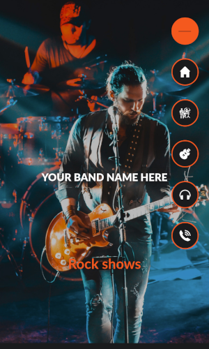

# Quart d'Heure Kiwi - Official Website :guitar:

<p align="center">
  <!-- Optional: Update screenshots if the look has changed significantly -->
  
</p>
<p align="center">
  
</p>
<!-- Optional: Remove mobile menu screenshot if less relevant now -->
<!-- <p align="center">
  
</p> -->


:point_right: **Visit the live site:** [quartdheurekiwi.com](https://quartdheurekiwi.com/) | [quartdheurekiwi.fr](https://quartdheurekiwi.fr/) :metal:

## About This Site

This repository contains the source code for the official website of **Quart d'Heure Kiwi**, a *Punk Rock Approximatif* band.

The site is designed for fans to find music, photos, and concert dates, and for potential venues to get information and contact the band.

## Features & Sections

*   **Hero Section:** Main band logo with social media links.
*   **Music:** Embedded videos and links to streaming/social platforms (Spotify, Bandcamp, YouTube, etc.).
*   **Gallery:** Photos of the band.
*   **Le Groupe:** Information about the band members.
*   **Concerts:** List of upcoming shows.
*   **Contact:** Simple contact information with the band's email address and social links.

## Technology Stack

*   HTML5
*   CSS3 (Utilizing CSS Variables, Flexbox, Grid, Animations)
*   JavaScript (jQuery, LazyLoad for images, Rellax for parallax effect)
*   Deployment: Hosted on [Netlify](https://www.netlify.com/) and automatically deployed from this GitHub repository.

## Development

To run the website locally for development or testing:

1.  **Clone this repository:**
    ```bash
    git clone <URL of THIS repository>
    ```
    *(Replace `<URL of THIS repository>` with the actual URL, e.g., `https://github.com/YOUR_USERNAME/YOUR_REPO_NAME.git`)*

2.  **Navigate into the directory:**
    ```bash
    cd <repository-directory-name>
    ```

3.  **Open `index.html`:**
    Open the `index.html` file directly in your web browser. Most features should work, but browser security might affect certain interactions when run as a local file compared to being served.

*(Note: This site is static and does not require a complex build process or backend server.)*

---

*This website was originally based on the [Free Rock Band Website Template](https://github.com/gtcore902/free-rock-band-website-template) by gtcore902, but has been significantly modified.*